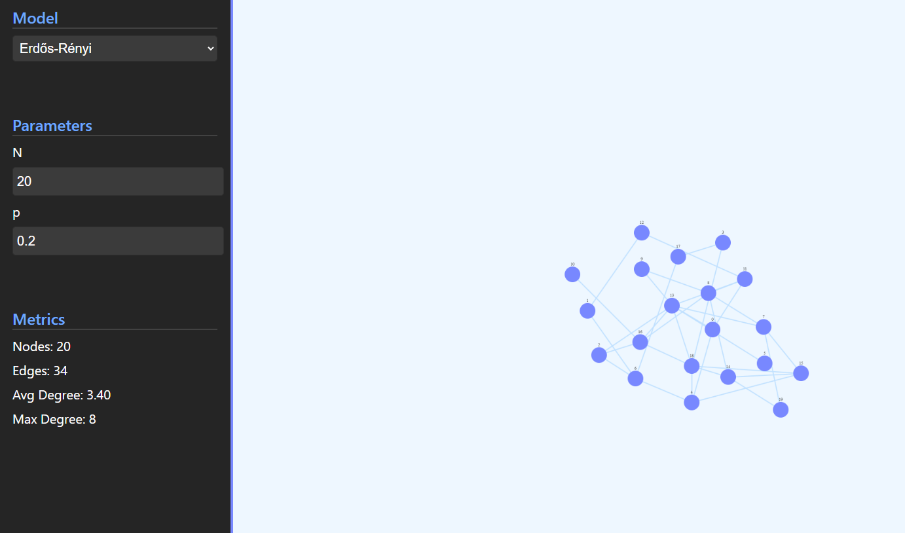

# Network Science Models Visualization

## Introduction 🔎

This project is a visualization of the network science models.

Uses [CytoScape.js](https://js.cytoscape.org/) to visualize the models.

Check it out here: <https://murf-y.github.io/NetworkModelsVisualization/>

## Preview 🔥

## License 📖

This project is licensed under the MIT License - see the [LICENSE.md](LICENSE.md) file for details
